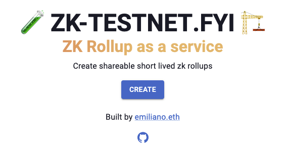
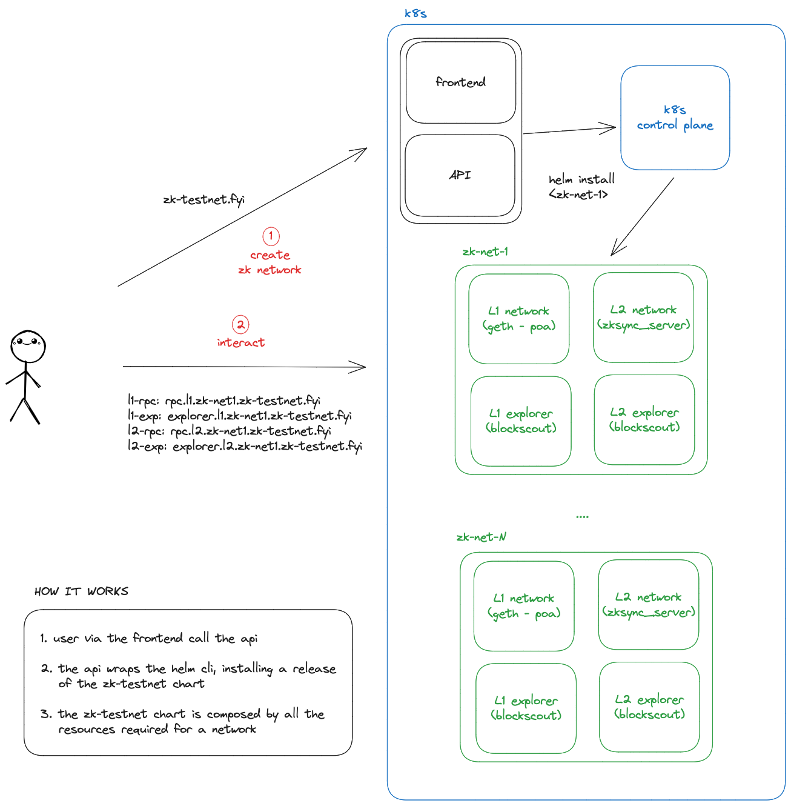

# 🧪 zktestnet.fyi 🏗️

A simple [ZK Rollup as a Service](https://zktestnet.fyi) - create shareable short lived zk rollups in 1-click!

    

Based on [Kubernetes](https://kubernetes.io/), [AWS](https://aws.amazon.com/) and [Blockscout](https://github.com/blockscout/blockscout)

Currently supporting only [zkSync Era](https://github.com/matter-labs/zksync-era)

## High level description

A simple [API](./api) to spawn the infra required to run the rollup:

- L1 network
- L1 explorer
- L2 network
- L2 explorer

A simple [frontend](./frontend) to interact with the API

Architecture below

    

## Install locally

Before you need:
- [Docker](https://docs.docker.com/get-docker/)
- Kubernetes distro, e.g. [minikube](https://minikube.sigs.k8s.io/docs/start/)
- [Kubectl](https://kubernetes.io/docs/tasks/tools/#kubectl)
- [Helm](https://helm.sh/docs/intro/install/#from-script)

3 steps

1. run `helm install zk-testnet ./chart` to install the app
2. redirect everything for `*.testnet.local` to localhost (e.g. editing `/etc/hosts`)
3. forward the traffic from your k8s cluster to localhost `minikube tunnel`

Then browse at http://testnet.local and start creating as many rollups as you need!

## Contributing

Feel free to dive in and fork, there are already some improvements/fixes to be made!

[Open](https://github.com/emilianobonassi/zk-testnet-fyi/issues/new) an issue, [start](https://github.com/emilianobonassi/zk-testnet-fyi/discussions/new) a discussion or submit a PR